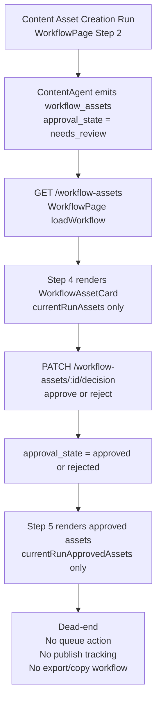
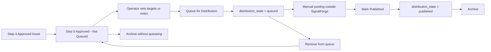
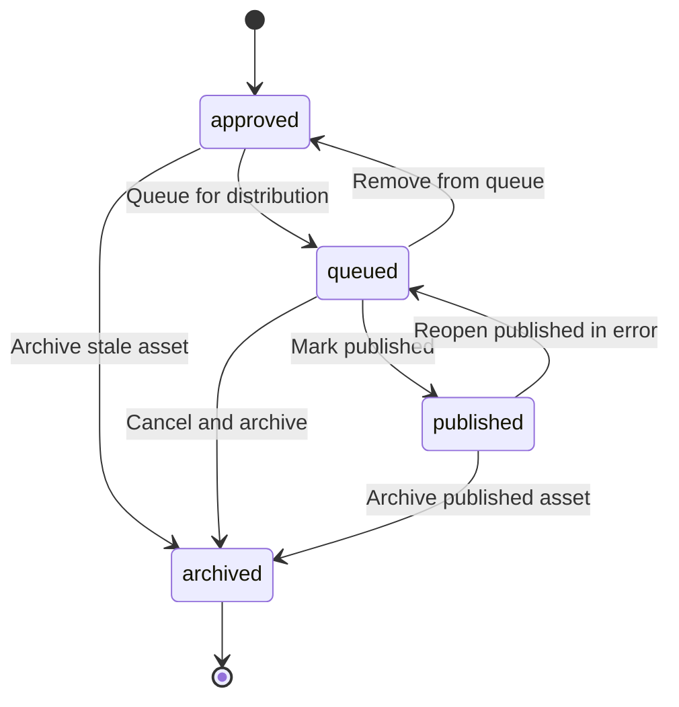

# Phase 5C Distribution Queue Discovery

## Purpose

Define the smallest safe additive operator-facing distribution queue model for approved `workflow_assets`.

This document is discovery only. It does not implement any backend, frontend, API, schema, scheduler, or posting integration changes.

## Scope

This proposal covers the operator workflow after a `workflow_asset` has already been approved in Step 4 and rendered in Step 5.

It focuses on:

- queue semantics for approved assets
- manual distribution tracking
- minimal future schema additions
- Step 5 UI architecture
- risk boundaries and rollout sequencing

## Current System Trace

### End-to-End Flow Today



### Exact Files In Current Flow

| File | Current role |
| --- | --- |
| `agents/base_agent.py` | `create_workflow_assets()` inserts additive records into `workflow_assets` only |
| `agents/content_agent.py` | `_emit_workflow_assets()` builds asset docs for `media_growth` and writes synthetic demo assets plus GPT-derived assets |
| `services/api/main.py` | `GET /workflow-assets` lists assets; `PATCH /workflow-assets/{asset_id}/decision` updates `approval_state` only |
| `services/web/src/api.js` | `api.workflowAssets()` and `api.decideWorkflowAsset()` wire the frontend to those endpoints |
| `services/web/src/components/WorkflowAssetCard.jsx` | reusable asset card for Step 4 and Step 5 display |
| `services/web/src/pages/WorkflowPage.jsx` | Step 4 approval flow, Step 5 approved asset rendering, next-step routing |
| `services/web/src/navigation/workflowTemplates.js` | Step 5 label and operator-facing copy: `Queue for Distribution` |
| `docs/PHASE_5_STRUCTURED_OUTPUT_ASSETS.md` | prior Phase 5 architecture and transition notes |

### Current Asset Creation

In `agents/content_agent.py`, `_emit_workflow_assets()` creates asset docs with the following currently relevant fields:

- `asset_id`
- `run_id`
- `task_id`
- `module`
- `workspace_slug`
- `profile_id`
- `asset_type`
- `output_category`
- `platform`
- `title`
- `summary`
- `body`
- `sections`
- `metadata`
- `approval_state`
- `source_agent`
- `simulation_only`
- `is_test`
- `created_at`
- `updated_at`

Current creation semantics:

- assets are inserted directly into `workflow_assets`
- content assets start as `approval_state = "needs_review"`
- synthetic demo assets are marked with `metadata.synthetic_demo = true`
- there is no distribution-specific field today

### Current Approval Transition

In `services/api/main.py`, `PATCH /workflow-assets/{asset_id}/decision` only supports:

- `approve` -> `approval_state = "approved"`
- `reject` -> `approval_state = "rejected"`

Current approval state model is therefore:

- `needs_review`
- `approved`
- `rejected`

There is no current concept of:

- queued
- scheduled
- published
- archived
- operator distribution notes
- platform-specific posting outcome

### Current Step 4 Assumptions

In `services/web/src/pages/WorkflowPage.jsx`:

- `currentRunAssets` is filtered by `run_id === currentRunId` and `approval_state !== "rejected"`
- Step 4 renders only current-run workflow assets above approval requests
- same-profile and backlog sections are implemented for message drafts and approval requests, not workflow assets
- asset rejection removes the asset from Step 4 because `WorkflowAssetCard` returns `null` for rejected assets

In `services/web/src/components/WorkflowAssetCard.jsx`:

- `approval_state` is the only state badge on the card
- `asset.platform || asset.metadata.platform` is used as a display chip only
- approved assets show a passive message: `Approved - ready for distribution queue.`
- the card has no queue, schedule, export, copy, or publish tracking controls

### Current Step 5 Assumptions

In `services/web/src/pages/WorkflowPage.jsx`:

- `currentRunApprovedAssets` is filtered by `run_id === currentRunId` and `approval_state === "approved"`
- Step 5 counts `readyToSend.length + currentRunApprovedAssets.length`
- Step 5 renders `Approved Workflow Assets` above `Ready to Send Message Drafts`
- workflow assets are current-run only in Step 5
- approved message drafts remain a separate legacy/manual-send queue

### Current Dead-End After Approval

Once a workflow asset is approved:

- it appears in Step 5
- it has no operator action beyond visual confirmation
- there is no way to mark it queued
- there is no way to record where it should be posted
- there is no way to store scheduling intent
- there is no way to record that it was manually published
- there is no way to store the published URL
- there is no backlog or archive view for approved assets

That makes the current Step 5 a display-only holding area rather than a true distribution queue.

## Reusable UI And Data Building Blocks

### Existing Reusable Fields

These existing `workflow_assets` fields should be reused as-is before adding anything new:

- `profile_id` for profile scoping
- `module` for profile/module filtering
- `workspace_slug` for workspace isolation
- `run_id` and `task_id` for current-run grouping
- `asset_type` for card presentation and grouping
- `output_category` for future Step 5 sections
- `platform` and `metadata.platform` as initial platform suggestions
- `title`, `summary`, and `body` for copy/export workflows
- `created_at` and `updated_at` for staleness and queue age
- `simulation_only` and `metadata.synthetic_demo` for test/demo labeling

### Existing Reusable Components And Patterns

These frontend pieces should be reused where possible:

- `WorkflowAssetCard.jsx` as the base renderer for asset content
- `StepSection` in `WorkflowPage.jsx` for Step 5 section structure
- `EmptyState` for empty queue states
- `StatusBadge` for compact badge rendering
- `CommandContextCard` count chips for queue summary
- current-run / same-profile / backlog grouping patterns already used in Step 4

## Minimal Distribution Queue Model

### Design Principle

The smallest safe additive model is:

- approval remains the gate into Step 5
- distribution becomes a second, separate state machine
- no posting integration is introduced
- no scheduler engine is introduced
- every action remains human-operated and manually confirmed

### Core Semantics

`queued_for_distribution` should be a distribution semantic, not an approval semantic.

Recommended interpretation:

- `approval_state = "approved"` means the asset content is approved for operator use
- `distribution_state = "queued"` means the operator has intentionally placed the approved asset into a manual distribution queue

That separation prevents overloading `approval_state` with downstream fulfillment meaning.

### Minimal Operator Workflow

Recommended future workflow:

1. Asset is approved in Step 4.
2. Asset appears in Step 5 under `Approved - Not Queued`.
3. Operator optionally sets target platform, channel, schedule metadata, and notes.
4. Operator clicks `Queue for Distribution`.
5. Asset moves to `Queued` in Step 5.
6. Operator manually posts the asset outside SignalForge.
7. Operator returns and records publish outcome with optional URL and notes.
8. Asset moves to `Published`.
9. Asset can later be archived to remove it from active queue views.

### Manual-Only Distribution Actions

Recommended Step 5 actions for the smallest additive path:

- `Copy title`
- `Copy body`
- `Copy platform notes`
- `Queue for distribution`
- `Remove from queue`
- `Mark published`
- `Archive`

Do not add:

- automated posting
- scheduler jobs
- external social API calls
- webhook delivery

### Platform Targeting

Minimal future platform targeting should:

- default from `asset.platform` or `asset.metadata.platform` when present
- allow operator normalization into one or more explicit distribution targets
- stay descriptive only for 5C.x

Recommended target examples:

- `LinkedIn`
- `Instagram`
- `TikTok`
- `YouTube Shorts`
- `Email newsletter`
- `Podcast promo`

### Optional Scheduling Metadata

Scheduling metadata should be optional and manual-only.

Recommended meaning:

- `scheduled_for` stores operator intent only
- no job runner executes it
- overdue scheduled items remain visible until manually published or unqueued

### Operator Notes

`distribution_notes` should capture operator-side distribution context such as:

- posting edits made outside SignalForge
- external scheduler location
- campaign timing rationale
- publishing checklist reminders
- reason for unqueue or rollback

### Export And Copy Workflows

The smallest additive path should support export/copy before any richer asset packaging.

Recommended 5C.x behavior:

- copy plain title
- copy plain body
- copy platform suggestion
- optionally export markdown or JSON payload in a later additive slice

### Manual Publish Tracking

Manual publish tracking should let the operator record:

- what channel was used
- when the asset went live
- where it was published
- any outcome or caveat note

This preserves auditability without turning SignalForge into a posting engine.

## Proposed Future Schema Additions

These are proposal-only fields. They are not present today.

### Separation Of Concerns

Approval state answers:

- Is the content itself approved for operator use?

Distribution state answers:

- Has the approved content been intentionally queued, manually published, or archived?

Recommended split:

- `approval_state`: `needs_review | approved | rejected`
- `distribution_state`: `not_queued | queued | published | archived`

### Exact Proposed Fields

| Field | Type | Default | Purpose |
| --- | --- | --- | --- |
| `distribution_state` | string enum | `not_queued` | distribution lifecycle separate from approval |
| `distribution_targets` | array of strings | `[]` | intended target platforms or endpoints |
| `scheduled_for` | datetime or null | `null` | optional operator-entered manual scheduling intent |
| `distributed_at` | datetime or null | `null` | when operator marked the asset as manually published |
| `distribution_notes` | string or null | `null` | freeform operator note for queue/publish handling |
| `distribution_channel` | string or null | `null` | manual channel used, such as `manual_post`, `external_scheduler`, or `newsletter_tool` |
| `published_url` | string or null | `null` | canonical URL or reference to the published result |

### Minimal Schema Recommendation

Recommended first additive structure:

```json
{
  "approval_state": "approved",
  "distribution_state": "not_queued",
  "distribution_targets": ["LinkedIn"],
  "scheduled_for": null,
  "distributed_at": null,
  "distribution_notes": null,
  "distribution_channel": null,
  "published_url": null
}
```

### Why This Is Minimal

This structure is deliberately small because it:

- avoids per-target delivery receipts
- avoids scheduler execution state
- avoids posting provider credentials
- avoids a second collection
- keeps the queue state attached to the source asset

## UI Architecture Proposal

### Step 5 Layout

Recommended future Step 5 layout:

1. `Approved - Not Queued (Current Run)`
2. `Queued For Distribution (Current Run)`
3. `Same Profile Backlog` collapsed by default
4. `Recently Published` collapsed by default
5. legacy `Ready to Send Message Drafts` section retained beneath asset queue sections until later convergence

### Queue Card Strategy

Reuse `WorkflowAssetCard` as the content body renderer.

Recommended composition pattern:

- keep the current card body, summary, preview, and platform chips
- add a small Step 5-only footer or wrapper with distribution actions and metadata
- do not fork a completely separate asset card unless layout divergence becomes unavoidable

This keeps Step 4 and Step 5 visually aligned while allowing Step 5-specific actions.

### Step 5 Card Footer Proposal

Recommended Step 5-only footer controls:

- distribution badge row
- target platform selector or chips
- optional `scheduled_for` display
- optional operator note field
- `Queue`, `Unqueue`, `Mark published`, and `Archive` actions
- `Copy title` and `Copy body` quick actions

### Badge Model

Recommended badges on Step 5 asset cards:

- approval badge: existing `approved`
- distribution badge: `not queued`, `queued`, `published`, `archived`
- optional schedule badge: `scheduled today`, `overdue`, `unscheduled`

Approval and distribution badges should both be visible when the asset is active in Step 5.

### Filtering And Grouping Behavior

Recommended Step 5 grouping rules:

- current run first
- same profile other runs second, collapsed by default
- cross-profile backlog excluded by default
- archived hidden from default view
- published items shown in a separate recent-history section, not mixed into active queue

### Current-Run Versus Backlog Handling

Recommended asset queue scoping:

- current run remains the default active context
- same-profile backlog is accessible but collapsed
- cross-profile assets should not mix into the active queue by default
- workspace filtering should continue to apply exactly as it does now

This mirrors Step 4 mental models and reduces accidental cross-profile handling.

## Lifecycle And State Machine Proposal

### Architecture Diagram



### Lifecycle Diagram



### Allowed Transitions

Recommended transitions:

- `approved -> queued`
- `approved -> archived`
- `queued -> approved`
- `queued -> published`
- `queued -> archived`
- `published -> archived`
- `published -> queued` only as a corrective rollback when the operator marked publish in error

### Rollback Semantics

Recommended rollback behavior:

- unqueueing should preserve `approval_state = approved`
- rolling back `published -> queued` should require clearing or revising `published_url` and `distributed_at`
- archiving should remove the asset from active queue views without changing approval history
- archived should be terminal for 5C.x active UI; restoration can be deferred to a later phase

## Risk Analysis

### Platform Drift

Risk:

- assets may be written with loose platform labels in `platform` or `metadata.platform`

Mitigation:

- normalize operator-selected `distribution_targets` against a small enum-like option set in the UI
- treat legacy platform strings as suggestions, not source of truth

### Duplicate Publishing

Risk:

- an operator may manually publish the same approved asset twice

Mitigation:

- visible `queued` and `published` badges
- require explicit `Mark published` confirmation
- preserve `distributed_at` and `published_url` for audit trail

### Manual Versus Automated Publishing Confusion

Risk:

- Step 5 copy could imply SignalForge will post automatically

Mitigation:

- keep all button labels manual and explicit
- add helper copy such as `Tracking only - posting happens outside SignalForge`
- avoid verbs like `schedule post` unless clearly labeled as metadata only

### Scheduling Edge Cases

Risk:

- `scheduled_for` may pass without any real publishing action

Mitigation:

- treat schedule as intent only
- show overdue badge or filter later
- never auto-transition state from time passage alone

### Stale Approved Assets

Risk:

- approved assets can sit indefinitely without being queued or published

Mitigation:

- add age-based badges later
- support `Archive` from `approved`
- expose `Approved - Not Queued` as a distinct section so stagnation is visible

### Queue Overload

Risk:

- large backlogs can make Step 5 noisy and unmanageable

Mitigation:

- current run first
- same-profile backlog collapsed
- published and archived hidden behind separate sections

### Cross-Profile Contamination

Risk:

- one profile's queue could surface assets from another profile or workspace

Mitigation:

- keep `profile_id`, `module`, and `workspace_slug` filtering aligned with current Step 4 patterns
- exclude cross-profile backlog from default active Step 5 views

## Phase Breakdown

### Phase 5C.1

Goal:

- turn Step 5 from a passive approved-assets view into a minimal manual distribution queue for workflow assets only

Recommended scope:

- additive fields on `workflow_assets` for distribution tracking
- Step 5 sections for `Approved - Not Queued` and `Queued`
- queue, unqueue, mark published, and archive actions
- simple copy/export helpers
- no scheduler execution
- no automated posting

Rollback:

- ignore new distribution fields and fall back to the current approved-only Step 5 rendering

### Phase 5C.2

Goal:

- make the queue operationally manageable for real operators over time

Recommended scope:

- same-profile backlog in Step 5
- recent published section
- filtering by distribution state and target
- staleness indicators
- richer operator notes and publish tracking affordances

Rollback:

- hide backlog/history sections and keep only current-run queue actions

### Phase 5D

Goal:

- prepare for future external distribution handoff without adding automated posting yet

Recommended scope:

- optional richer export payloads
- optional per-target publish bookkeeping
- optional queue analytics and reporting
- explicit handoff patterns to external schedulers as metadata only

Rollback:

- remove advanced publish bookkeeping while preserving the 5C.x core queue states on the asset records

## Validation Checklist

### Frontend Checks

- Step 5 shows approved assets separately from queued assets
- `WorkflowAssetCard` content remains unchanged and readable in Step 5
- distribution badges do not replace approval badges
- current-run queue renders before backlog sections
- archived assets do not appear in active queue views
- manual copy/export actions do not imply outbound automation

### Backend Checks

- legacy assets without distribution fields still render correctly
- default behavior for missing distribution fields resolves to `not_queued`
- filtering by `profile_id`, `module`, `run_id`, and `workspace_slug` remains intact
- approval decision logic remains independent from distribution updates

### Workflow Checks

- approve asset in Step 4 -> asset appears in `Approved - Not Queued`
- queue asset -> asset moves to `Queued`
- unqueue asset -> asset returns to `Approved - Not Queued`
- mark published -> asset leaves active queue and enters published history
- archive stale approved asset -> asset leaves active queue without changing approval history

### Operator UX Checks

- operator can tell the difference between message draft send queue and workflow asset distribution queue
- operator can see where the asset is intended to be posted
- operator can record manual posting outcome without needing external automation
- operator can recover from an accidental publish or queue action without data loss

## Migration Strategy

Recommended future migration strategy:

- additive fields only on `workflow_assets`
- no new collection required for 5C.x
- no backfill required for legacy assets
- read logic should treat missing distribution fields as `distribution_state = not_queued`
- writes should only populate distribution fields for newly touched assets

This keeps rollout independently deployable and independently rollbackable.

## Implementation Recommendations

When implementation is approved later, the safest order is:

1. Add distribution fields and defaults without changing existing approval behavior.
2. Add Step 5 queue sections and badges while keeping approved-only rendering compatible.
3. Add manual publish tracking actions.
4. Add backlog and history management only after current-run queue behavior is stable.

## Not In Scope

Explicitly not in scope for Phase 5C discovery and the recommended first implementation slices:

- automated posting to any social platform
- API integrations with LinkedIn, Meta, TikTok, YouTube, or newsletter providers
- cron jobs, scheduler workers, or time-based publishing automation
- webhook delivery
- provider OAuth flows
- external content rendering pipelines
- bulk publishing orchestration
- message draft workflow replacement
- approval-state redesign beyond preserving the current approval gate

## Summary Recommendation

The smallest safe additive path is to keep Step 4 approval exactly as the content gate, add a second distribution lifecycle on the same `workflow_assets` records, and make Step 5 a manual tracking queue rather than a passive approved-asset shelf.

That delivers operator value without adding posting infrastructure, preserves current workflow semantics, and keeps 5C.1, 5C.2, and 5D independently deployable and independently rollbackable.